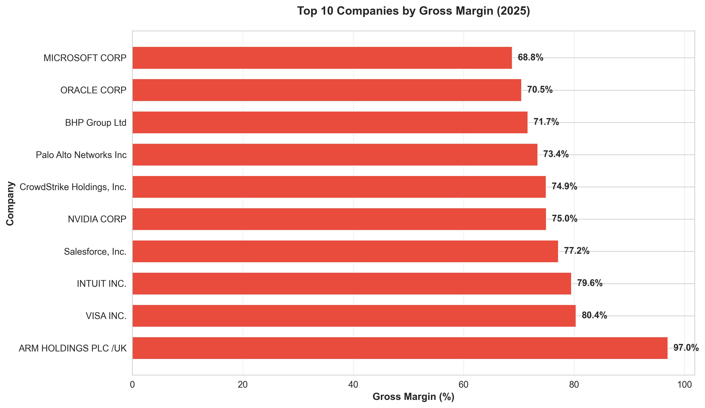
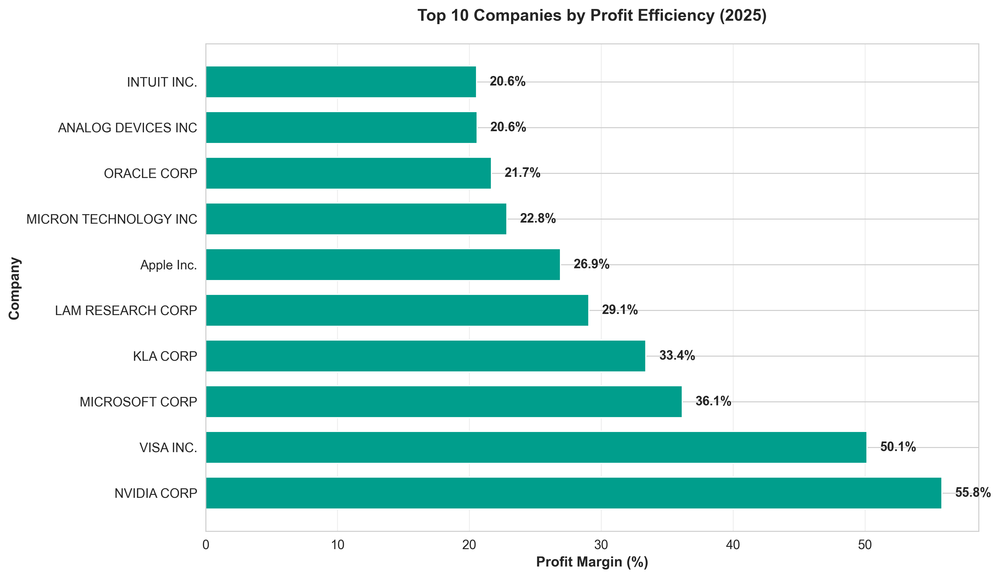
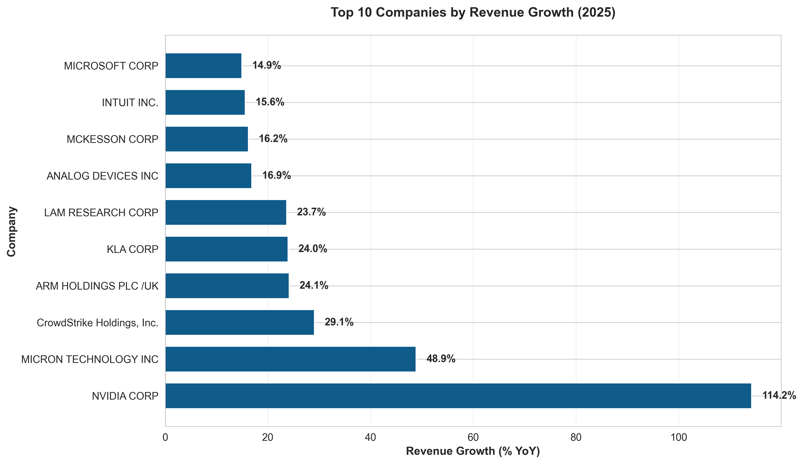
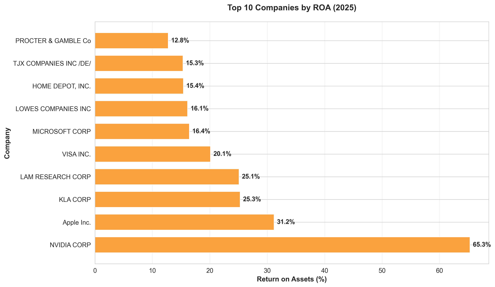

# Case Study: Working Student Data Engineering
## Extract and Prepare Data from a Public Source

This project demonstrates the extraction, transformation, cleaning, and visualization of financial data for publicly listed companies. The dataset was sourced from **SEC tickers** and **Yahoo Finance (`yfinance`)**, providing company-level financial data for selected companies.

## Data Sources

- **SEC API:** For company tickers and basic company information.  
- **Yahoo Finance (`yfinance`):** For financial data, including income statement, balance sheet, and KPIs.  
- **Kaggle datasets:** Explored for additional data but found incomplete/inconsistent and not used in the final pipeline.

## Data Requirements Implemented

The dataset includes the following fields:

| Field              | Description |
|-------------------|-------------|
| Company name       | Name of the company |
| Country            | Headquarters country |
| Industry           | Industry classification |
| Year               | Financial year (most recent 3 years) |
| Revenue            | Revenue figure |
| Revenue unit       | Unit or currency of the revenue |
| Net Income         | Net profit for the year |
| Gross Profit       | Profit after cost of goods sold |
| Net Profit Margin  | Net income / revenue (%) |
| Gross Profit Margin| Gross profit / revenue (%) |
| ROA                | Return on Assets (%) |
| Basic EPS          | Earnings per share |

## Project Structure
├── data
│ ├── raw 
│ └── processed 
|     └── reports
├── src
│ ├── extract.py 
│ ├── transform.py 
│ ├── clean.py 
│ ├── charts.py 
│ ├── main.py 
│ ├── app.py 
│ └── config.py 
├── dirty_exploration 
├── requirements.txt 
└── README.md

## Features

- **Data Extraction:** Extract SEC tickers and fetch financial data using `yfinance`.  

- **Data Transformation:** Combine company info with KPIs and financial metrics.  

- **Data Cleaning:** Clean numerical data, interpolate missing values, format large numbers and percentages. 

- **Data Visualization:** Generate charts for key KPIs (profit efficiency, revenue growth, ROA, gross margin). 

- **Interactive Exploration:** Streamlit app with filters for country, company, industry, and year.  

- **ETL Orchestration:** `main.py` runs the full pipeline automatically.

1. Clone the repository:
git clone https://github.com/gnanashri/statista-financial-data-pipeline.git
cd statista-financial-data-pipeline

2. Create a virtual environment and activate it:
pip install virtualenv
virtualenv venv
source venv/bin/activate

3. Install dependencies:
pip install -r requirements.txt

4. Run the pipeline:
python src/main.py

5. Run the Streamlit app:
streamlit run src/app.py

## Outputs:

Cleaned and processed data (CSV and JSON) in data/processed/

KPI charts in data/processed/reports/

Interactive dashboard for visual exploration via <link>

data/
├── raw/
│   ├── company_tickers.json      
│   └── selected_companies.json    
│   ├── financial_data.csv         
│   ├── financial_data.json
│   ├── financial_data_cleaned.csv
│   ├── financial_data_cleaned.json
│   └── reports/    # KPI charts

## Screenshots

## KPI Charts

### Gross Margin Strength

### Profit Efficiency

### Revenue Growth

### Return on Assets (ROA)

